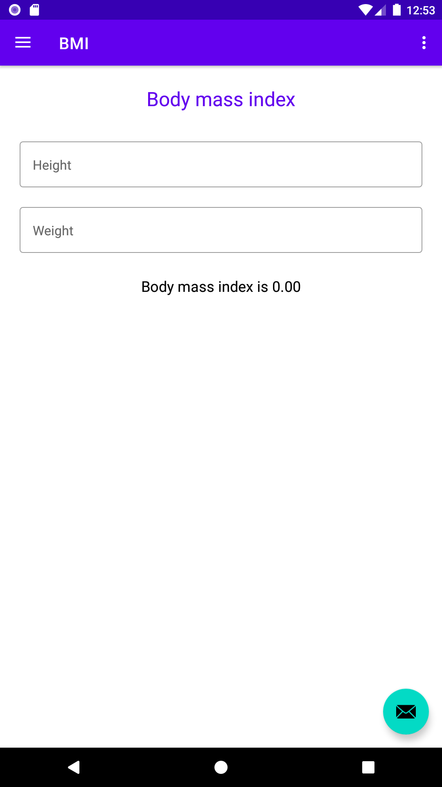
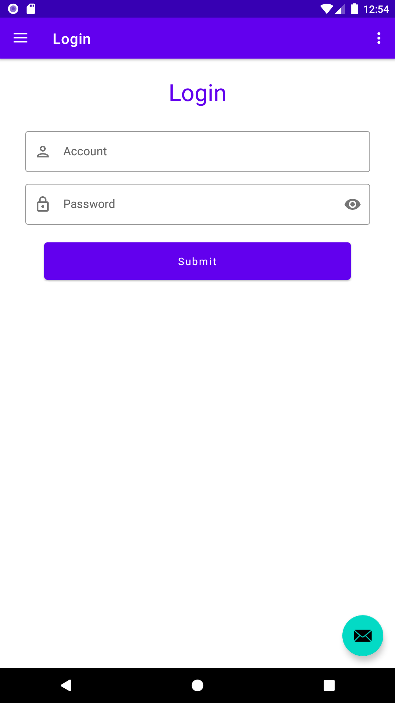
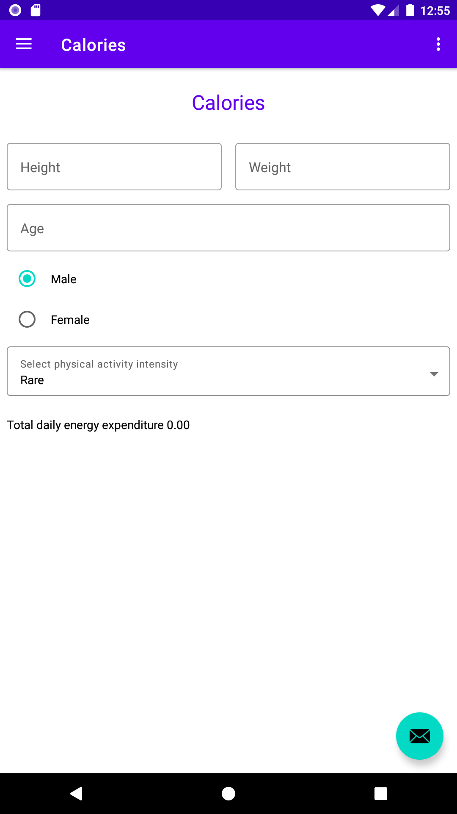

# Kotlin walk through

A learning diary of kotlin android development.

## Description

Bmi calculator:

Login form:

Calories calculator:

## Question & Answer

### No Android SDK?
Just download it, and setup environment variable `ANDROID_HOME=\\PATH_TO_SDK`
